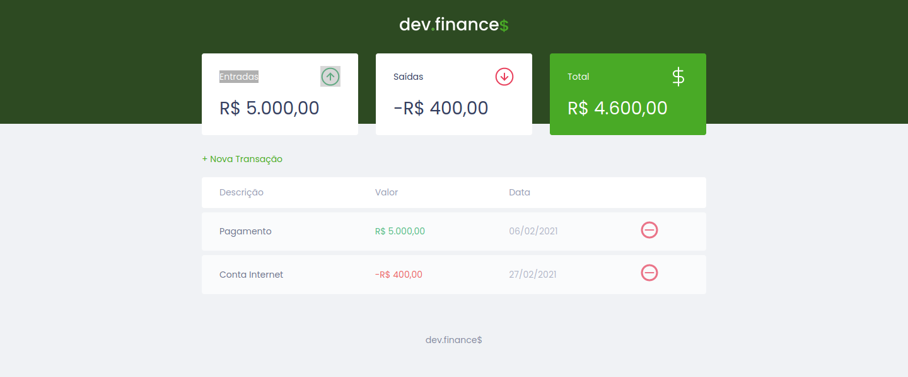

<h1 align="center">
  
</h1>

  <a href="#-tecnologias">Tecnologias</a>&nbsp;&nbsp;&nbsp;|&nbsp;&nbsp;&nbsp;
  <a href="#-projeto">Projeto</a>&nbsp;&nbsp;&nbsp;|&nbsp;&nbsp;&nbsp;
  <a href="#-Milha Extra">Layout</a>&nbsp;&nbsp;&nbsp;|&nbsp;&nbsp;&nbsp;

 

  

 

## 🚀 Tecnologias

Esse projeto foi desenvolvido com as seguintes tecnologias:

- HTML
- CSS
- JavaScript

 

## 💻 Projeto

O dev.finances é uma ideia de aplicação para controle de finanças pessoais. Nele é possível incluir e excluir transações, informando a descrição do pagamento ou despesa, seu valor e a data da operação. Por fim, é apresentado o balanço geral e o total de dinheiro movimentado de entradas e saídas.

 

## Milha Extra

Foi adicionada uma pequena animação de entrada aos cards com os valores de Entrada, Saída e Total.

 

---

Feito com ♥ by Rocketseat :wave: [Participe da nossa comunidade!](https://discordapp.com/invite/gCRAFhc)
